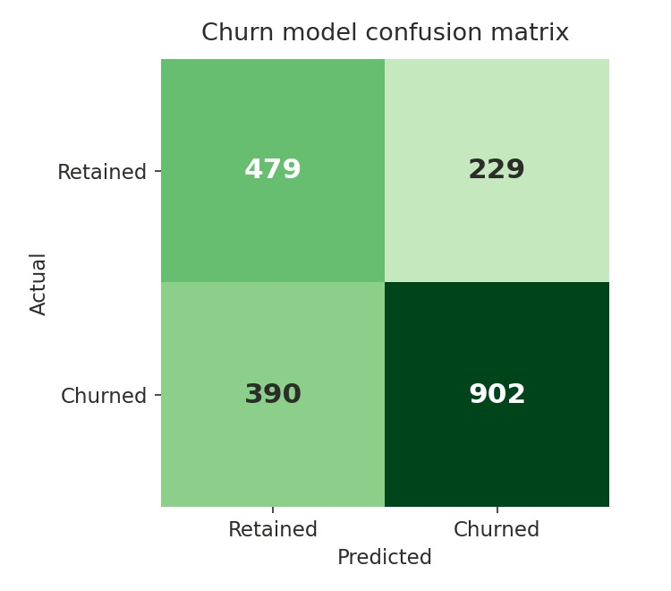
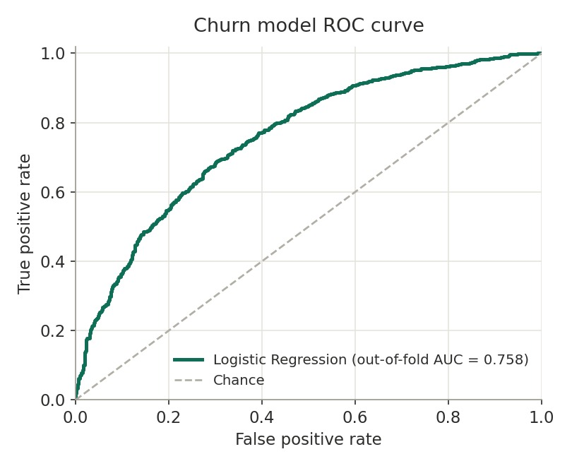

# Customer Churn Analytics

## Overview

This project predicts customer churn from subscription and account data, then exports a Tableau-ready dataset with churn predictions, probabilities, risk tiers, and revenue-at-risk fields for business review.

The pipeline covers seeded synthetic data generation, data cleaning across two source tables, churn feature engineering, leakage-safe feature selection, a Logistic Regression and Random Forest comparison, out-of-fold scoring, and a dashboard export with per-customer churn risk.

## Problem

Subscription businesses lose revenue quietly when customers cancel. The goal is to score each customer's churn risk from account attributes, support activity, transaction behavior, and subscription timing, so retention work can focus on the customers most likely to leave.

## What it is and what it isn't

What it is:

- A reproducible end-to-end pipeline from raw CSVs to dashboard-ready output
- A worked example of leakage-aware feature selection and out-of-fold scoring in a churn setting
- The data source for the Tableau churn dashboard

What it isn't:

- A production scoring service. There is no API, scheduler, or model registry.
- A benchmark study on a public real-world churn dataset. The included data is synthetic and seeded so the project can be reproduced without private customer records.

## Data

Two input tables, joined on `customer_id`:

- `data/sample_customers.csv`: customer segment, region, account type, state, contract, payment, service, and household-style attributes
- `data/sample_subscriptions.csv`: subscription dates, cost, support calls, referral code, transaction activity, Telco-style billing drivers, and the churn label

The sample files contain 2,000 seeded synthetic customers and ship with the repo so the pipeline runs out of the box. Any pair of CSVs with matching columns can be substituted via the command-line flags.

Regenerate the sample files from the repo root:

```bash
python projects/customer-churn/src/generate_churn_data.py --rows 2000 --seed 42 --output-dir projects/customer-churn/data
```

## Workflow

The pipeline:

- Standardizes column names and normalizes null values across both tables
- Deduplicates customers and subscriptions before the join
- Derives the churn label from `subscription_end_date` when no explicit label exists, and normalizes text labels when one does
- Engineers features: referral flag plus subscription start year, month, and quarter
- Drops leakage-prone fields before modeling: `subscription_end_date`, `is_active`, `tenure_days`, `years_since_signup`, all per-day rate columns, all ID columns, and all date columns
- Selects numeric features and low-cardinality categorical features automatically
- Trains Logistic Regression and Random Forest models in scikit-learn pipelines
- Evaluates on a stratified 30 percent test split and also reports out-of-fold ROC-AUC
- Selects the winning model by out-of-fold ROC-AUC, with holdout ROC-AUC and accuracy as secondary context
- Exports the full dataset with out-of-fold churn probabilities from the winning model class
- Writes a single-feature AUC leakage screen and a static QA packet for Tableau review

## Running it

From the repo root:

```bash
pip install -r requirements.txt
python projects/customer-churn/src/Logistic_Regression_Customer_Churn.py --customers projects/customer-churn/data/sample_customers.csv --subscriptions projects/customer-churn/data/sample_subscriptions.csv --output-dir outputs/churn
```

Outputs land in `outputs/churn/`:

| File | Contents |
| --- | --- |
| `cleaned_data.csv` | Merged and cleaned dataset before scoring |
| `final_data_for_tableau.csv` | Full dataset plus model name, out-of-fold predicted churn probability, risk tier, revenue at risk, and impacted-customer flag |
| `model_metrics.csv` | Accuracy, holdout ROC-AUC, and out-of-fold ROC-AUC for both models |
| `confusion_matrix.csv` | Confusion matrix for the selected model |
| `classification_report.txt` | Precision, recall, and F1 for the selected model |
| `single_feature_auc.csv` | Leakage screen showing single-feature predictive strength |
| `probability_summary.csv` | Summary statistics for churn probabilities |
| `risk_tier_counts.csv` | Counts by churn risk tier |
| `top_impacted_customers.csv` | Highest revenue-at-risk customers for dashboard QA |
| `qa_packet.md` | Static pre-Tableau QA packet |

## Dashboard

The Tableau workbook in `dashboards/Churn_Model_Viz.twbx` visualizes the pipeline output across eight views, including churn probability distribution, churn by region, customer tenure against churn probability, revenue at risk, and support-call patterns by risk group.

Public Tableau link coming after the Phase 2 republish.





## Limitations

- The sample data is synthetic. It is designed to have genuine but imperfect churn signal, not to represent a specific company's customer base.
- Classification uses the default 0.5 threshold. A real retention program would tune the threshold against the cost of missed churners versus wasted outreach.
- There is no hyperparameter search. Model settings are sensible fixed choices, not tuned values.
- When no churn label is provided, churn is inferred from the presence of a subscription end date, which treats every ended subscription as churn.
